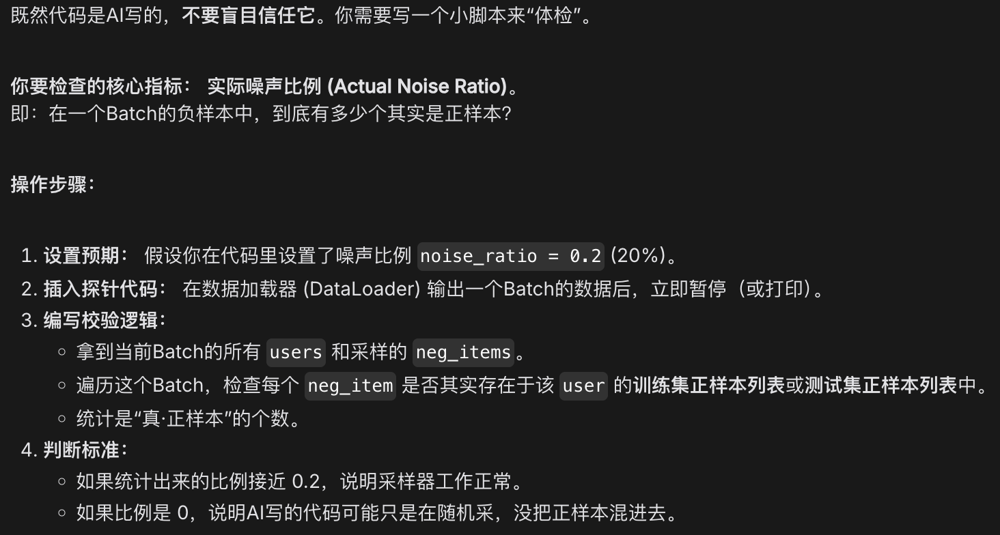
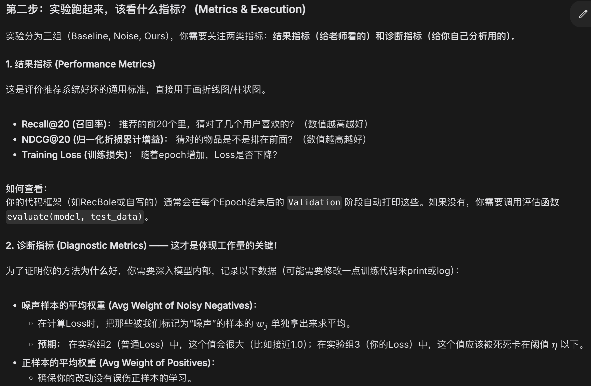
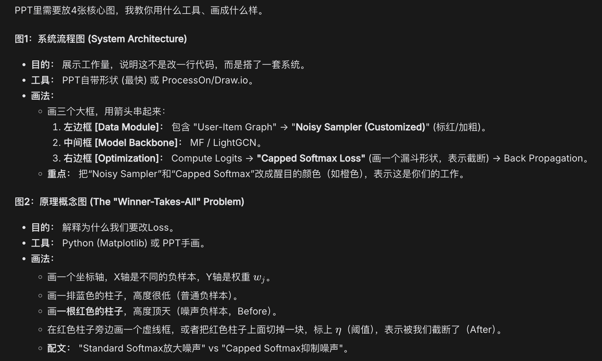
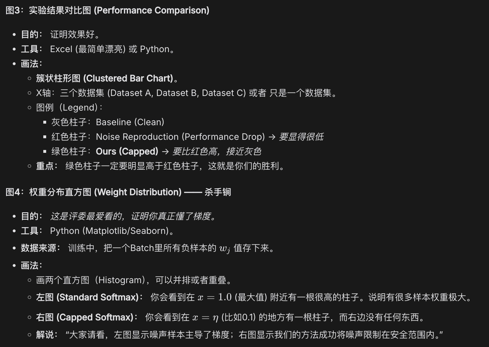

首先，代码工作上，我们要实现带噪负采样器，并实现改进的Softmax Loss (Capped Softmax Loss)。我在AI的辅助下完成了这部分，但我不知道如何检验带噪负采样器的有效性，不知道应该看哪些指标。
AI建议：

其次，我们要开始跑实验，检验分三组，进行对比实验，即实验组1 (Baseline)、实验组2 (问题复现)、实验组3 (我们的方法)，用于检验我们修改的算法效果。但是我不知道此处应该查看哪些指标，也不知道应该如何查看。
AI建议：

最后，我们要完成PPT的制作，绘制相应的图表。你前面提到了PPT中要插入很多图表，请逐一指导我制作这些图片。
AI建议：

